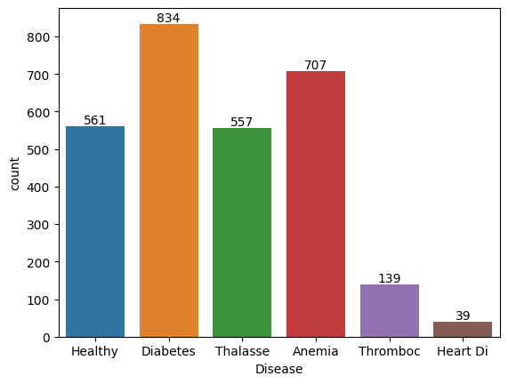

# **Multiple Disease Prediction**

## **Introduction**
This is my self-learning project. The dataset is the one I've collected from Kaggle, containing information about blood samples and other parameters. It is noted that this dataset is for learning purposes only.

Here are the features of the dataset. Additionally, the data has already been scaled to the range of 0 to 1.


```python
"""
    "Glucose": (70, 140),  # mg/dL
    "Cholesterol": (125, 200),  # mg/dL
    "Hemoglobin": (13.5, 17.5),  # g/dL
    "Platelets": (150000, 450000),  # per microliter of blood
    "White Blood Cells": (4000, 11000),  # per cubic millimeter of blood
    "Red Blood Cells": (4.2, 5.4),  # million cells per microliter of blood
    "Hematocrit": (38, 52),  # percentage
    "Mean Corpuscular Volume": (80, 100),  # femtoliters
    "Mean Corpuscular Hemoglobin": (27, 33),  # picograms
    "Mean Corpuscular Hemoglobin Concentration": (32, 36),  # grams per deciliter
    "Insulin": (5, 25),  # microU/mL
    "BMI": (18.5, 24.9),  # kg/m^2
    "Systolic Blood Pressure": (90, 120),  # mmHg
    "Diastolic Blood Pressure": (60, 80),  # mmHg
    "Triglycerides": (50, 150),  # mg/dL
    "HbA1c": (4, 6),  # percentage
    "LDL Cholesterol": (70, 130),  # mg/dL
    "HDL Cholesterol": (40, 60),  # mg/dL
    "ALT": (10, 40),  # U/L
    "AST": (10, 40),  # U/L
    "Heart Rate": (60, 100),  # beats per minute
    "Creatinine": (0.6, 1.2),  # mg/dL
    "Troponin": (0, 0.04),  # ng/mL
    "C-reactive Protein": (0, 3),  # mg/L
"""
```
The dataset consists of two CSV files. Due to the nature of blood samples, there are numerous duplicated instances. To address this, the data creator collected an additional file with one more label compared to the first file, aiming to introduce more diversity. I have concatenated these two files to create a unified dataset for this project, enabling the model to be trained on a more complex dataset.

From this dataset, I can visualize and conduct analytical searches to determine the percentage of each parameter and assess the potential implications of high or low values. Additionally, I can identify which diseases might be associated with these high or low parameter values. Subsequently, I aim to build a model capable of predicting which disease you might have based on your blood sample.

*Here is the link to the data source:* [https://www.kaggle.com/datasets/ehababoelnaga/multiple-disease-prediction/data](https://www.kaggle.com/datasets/ehababoelnaga/multiple-disease-prediction/data)

## **Methodology**
The dataset is well-prepared, and the data creator has done an excellent job in its creation. They have even scaled the data to the range of 0 to 1. I just need to make a few adjustments, such as encoding the labels or standard scaling the features, to ensure that the data works seamlessly with the library package.

A quick check through the dataset reveals that there are no null values. As mentioned earlier, due to the nature of blood samples and their scaling into a range from 0 to 1, there appear to be many duplicated instances when I drop the 'ID' column. Therefore, for the purposes of this project, I will not remove these duplicated instances but instead concatenate the two files of data to increase complexity.

I utilize the Matplotlib and Seaborn libraries to visualize and analyze the dataset. By examining the plots generated from these libraries, I gain further insights into the data. Finally, I use models from libraries such as Scikit-learn to train, select the best model, and fine-tune it using GridSearchCV for improved predictive performance.

There's no need for further feature engineering to train the model for this project.

## **Data Description**
The dataset comprises 2837 instances, each associated with one of six labels representing the names of diseases. Each instance contains 24 features, including parameters of the blood sample such as "Glucose", "Cholesterol", "Hemoglobin", "Platelets", ... Each feature has already been scaled to the range of 0 to 1.

From this dataset, I can visualize and conduct analytical searches to determine the percentage of each parameter and assess the potential implications of high or low values. Additionally, I can identify which diseases might be associated with these high or low parameter values. For example, if you have high glucose levels in your blood, you're more likely to develop Diabetes Disease...

The second dataset was created to include an additional disease label to prevent overfitting of the model caused by excessive duplicate data. Consequently, the number of instances for the additional disease sample is relatively small compared to other diseases. Furthermore, since the dataset was collected from real samples through the creator's research, it's possible that the dataset will exhibit label imbalance.

## **Results**
To start, I use a countplot to visualize the distribution of the label column in the dataset.

<div style="text-align:center; margin-bottom:20px;">
    
</div>

The countplot of labels clearly illustrates all the label names and the number of instances for each label. From this visualization, we can observe the imbalance in the dataset, with 'Heart Di' and 'Thromboc' labels having significantly fewer instances compared to others.

To further analyze the effect of each feature on the labels, I combine boxplots and histplots to visualize the distribution of each feature with respect to each label, as well as across the entire dataset.

For example, in the case of Glucose:
---
<div style="text-align:center; margin-bottom:20px;">
    
</div>

I observed that instances labeled as 'Healthy' typically exhibit Glucose levels ranging from 0.25 to 0.6 mg/dL, with an average of approximately 0.4 mg/dL in this dataset. Similar trends are observed for other labels: 'Diabetes' ranges from 0.35 to 0.75 with an average of 0.5, 'Thalasse' from 0.2 to 0.55 with an average of 0.4, 'Anemia' from 0.1 to 0.4 with an average of 0.2, 'Thromboc' from 0.1 to 0.4 with an average of 0.35, and 'Heart Di' from 0.2 to 0.6 with an average of 0.4.

From the histogram plot of Glucose for the entire dataset, I observe a gradual decrease in the number of instances, with the highest concentration occurring between 0.0 and 0.2. Consequently, the Glucose parameter is likely to have a significant impact on the number of instances for labels such as 'Diabetes', 'Thalasse', 'Anemia', and 'Thromboc'. Particularly noteworthy is the influence on 'Anemia', especially considering that the average number of instances falls slightly below 0.2.

For more details about number of instance for each label, I use histplot like below

<div style="text-align:center; margin-bottom:20px;">
    
</div>

Similarly, I apply this approach to analyze the Cholesterol feature.
---
<div style="text-align:center; margin-bottom:20px;">
    
</div>

Similar to the Glucose boxplot, the Cholesterol boxplot indicates that for 'Healthy' instances, the distribution of Cholesterol mostly falls within the range of 0.25 to 0.55, with an average exceeding 0.4. For 'Diabetes', the range is from 0.25 to 0.8, with an average of 0.4. 'Thalasse' instances show Cholesterol levels between 0.18 to 0.41, with an average around 0.3. 'Anemia' instances exhibit Cholesterol levels ranging from 0.2 to 0.5, with an average of 0.3. 'Thromboc' instances typically have Cholesterol levels ranging from 0.55 to 0.75, with an average around 0.6, although two special cases are noted at approximately 0.05 and 0.15. Finally, for 'Heart Di' instances, Cholesterol levels range from 0.3 to 0.65, with an average of about 0.5.

Based on the Cholesterol histplot for the entire dataset, I observe that the majority of instances are distributed between 0.0 and 0.4, with a notable concentration from 0.2 to 0.4. Most diseases exhibit their Cholesterol distribution within this range, especially 'Thalasse' and 'Anemia', which have average values inside that range. However, for the 'Thromboc' and 'Heart Di' labels, their distributions are slightly outside this range. This suggests that Cholesterol is a feature likely to have a strong effect on the instance distribution of all the labels in this dataset.

For further details of instance distribution, I'll show as below

<div style="text-align:center; margin-bottom:20px;">
    
</div>

As for the Hemoglobin feature
---
<div style="text-align:center; margin-bottom:20px;">
    
</div>

From the Hemoglobin Boxplot, it's evident that the distribution varies across different labels: 'Healthy' instances predominantly range from 0.38 to 0.75, averaging 0.6; 'Diabetes' instances span 0.3 to 0.9, with an average of 0.65; 'Thalasse' instances fall between 0.5 and 0.88, with an average slightly exceeding 0.6; 'Anemia' instances range from 0.25 to 0.75, averaging 0.5; 'Thromboc' instances are concentrated mainly around 0.78 to 0.8, with an average close to 0.79, yet scattered outliers exist from 0.0 to 0.6 and 0.88 to 1.0; finally, 'Heart Disease' instances span 0.2 to 0.6, with an average of 0.5.

Based on the Hemoglobin histplot for the entire dataset, it appears that the distribution is primarily concentrated in the range of 0.4 to 0.8, with the highest values around 0.7 to 0.8. Nearly all the labels fall within this range. This suggests that this feature has a significant effect on the instance distribution of all the labels, especially for 'Thromboc', as both the majority distribution and the average value lie fully within that range.

Below is the detailed instance distribution of each label

<div style="text-align:center; margin-bottom:20px;">
    
</div>

I will perform the same analysis for other features in the dataset.
---
*Plot of other feature:* [Images](Images)

---
After visualizing each feature, I will generate a correlation heatmap for each label and the features to see which features will affect each label. This will help me evaluate whether my previous assessment is accurate.

<div style="text-align:center; margin-bottom:20px;">
    
</div>

With the Correlation Heatmap, I can observe that there is a low correlation between the labels themselves, as evidenced by negative correlation scores between each label pair. Additionally, I can discern the impact of features on each disease prediction by examining the correlation scores.

For instance, when considering the 'Thromboc' disease, features such as 'Glucose', 'Platelets', 'Mean Corpuscular Volume', 'Mean Corpuscular Hemoglobin', and 'Insulin' exhibit very low effects, indicated by scores lower than 0. Conversely, features like 'Cholesterol', 'Hemoglobin', 'White Blood Cells', and 'Red Blood Cells' demonstrate a much higher influence on the prediction of 'Thromboc', as their scores are greater than 0.

---
After completing the analytical phase, I perform preprocessing steps such as label encoding, where each label is assigned an integer value starting from 0 using the replace function. Additionally, I rescale all the features using StandardScaler() to enhance the model's learning ability for prediction on the dataset. These preprocessing steps make the dataset suitable for machine learning algorithms to understand and process. Subsequently, I utilize models from libraries such as Scikit-learn to train, select the best model, and fine-tune it using GridSearchCV for improved predictive performance.

<div style="text-align:center; margin-bottom:20px;">
    
</div>

From the results, it is evident that the Random Forest model consistently achieves the highest scores in all evaluation metrics, followed by the SVM model. Conversely, the Logistic Regression model consistently produces the lowest scores across all evaluation metrics.

A Random Forest model with a train accuracy of 1.0 (or 100%) suggests that the model perfectly fits the training data. While this might seem impressive at first glance, it could also indicate potential issues, such as overfitting.

Therefore, even though a train accuracy of 1.0 may initially appear promising, it's crucial to assess the model's performance on unseen data (i.e., the test set or through cross-validation) to ensure that it generalizes well. In this case, the Random Forest model achieves a test accuracy of 0.956, which is quite high and suggests good generalization performance. This indicates that the model likely did not suffer significantly from overfitting.

In disease prediction, prioritizing recall (sensitivity) to maximize the detection of true positive cases is typically crucial, followed by maintaining a balance between precision and recall (as indicated by the F1-score) to ensure accurate and reliable predictions. Given that the Random Forest model demonstrates the highest scores in both metrics, it is the preferred choice for this dataset.

Finally, with GridSearchCV and the chosen hyperparameters, I tuned my model to achieve the following results:

<div style="text-align:center; margin-bottom:20px;">
    
</div>
